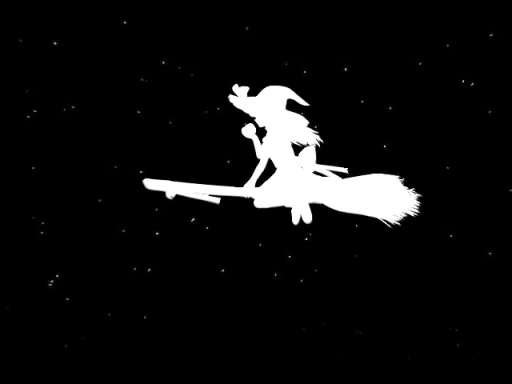

# bad-apple-ify

<picture align="center">
    
</picture>

Recreate Bad Apple (or any video, really) frame-by-frame using the most visually similar images from a gallery.

## How it works

1. Extract frames from the source video and convert to greyscale
2. Generate a brightness fingerprint for each frame using a configurable grid
3. Compare each fingerprint against a pre-processed gallery of images
4. Stitch the best-matching gallery images together into a new video

## Requirements

- Python 3.14+
- [uv](https://github.com/astral-sh/uv) for package management

## Usage

1. Download dependencies with `uv sync`
2. `uv run main.py`

## Configuration

Key parameters like grid resolution, output FPS, and file paths are configurable. See `config.py` for details.

## License

MIT
